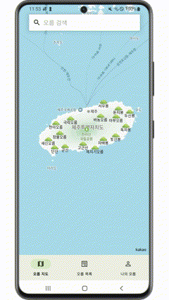

# 🌋 JejuOreum - 제주 오름 탐방 앱

**제주의 숨겨진 보물, 오름을 지도와 스탬프로 즐기자!**  
제주도 오름 정보를 시각화하여 탐색하고, 인증하며, 기록할 수 있는 Android 앱입니다.

---

## 📱 프로젝트 개요

- **앱 이름**: JejuOreum  
- **개발 기간**: 2025.01 ~ 2025.02
- **플랫폼**: Android  
- **개발 언어**: Kotlin  
- **개발 환경**: Android Studio  
- **데이터**: 제주 오름 Open API + Firebase Firestore  

**기획 의도**  
올레길보다 검색량이 많지만 관광 요소로 저평가된 '오름'을  
탐방·기록할 수 있는 앱을 통해 제주 관광 활성화를 도모하고자 개발했습니다.

---

## 🔍 주요 기능

- **회원가입 및 로그인**: 닉네임 기반 간편 회원가입 (Firestore 저장)  
- **지도 기반 탐색**: Kakao Map SDK로 오름 위치 시각화  
- **오름 상세 페이지**: 오름 정보 및 현재 위치 기반 거리 계산  
- **스탬프 인증**: 위치(GPS) 기반 방문 인증  
- **관심 오름 등록**: 즐겨찾기 기능 제공  

---

## 🛠 사용 기술 스택

| 기술 | 설명 |
|------|------|
| Kotlin | 메인 개발 언어 |
| Android Studio | 개발 환경 |
| Kakao Map SDK | 지도 기능 구현 |
| Retrofit | Open API 연동 |
| Firebase Firestore | 사용자 정보 및 상태 저장 |
| GPS | 위치 기반 기능 구현 |

---

## 📱 주요 기능 시연

### 📍 1. 지도 기반 오름 탐색

| 지도 전체 탐색 | 오름 선택 후 상세 이동 | 아이콘 변화 및 정보 표시 |
|:--:|:--:|:--:|
|  |  |  |

---

### 📋 2. 리스트 기반 오름 탐색

| 오름 리스트 보기 | 관심 오름 등록 |
|:--:|:--:|
|  |  |

---

### 🧭 3. 스탬프 기능

| 위치 기반 스탬프 인증 | 스탬프 규칙 확인 |
|:--:|:--:|
|  |  |

---

### 📝 4. 리뷰 기능

| 후기 확인 | 후기 작성 | 후기 삭제 |
|:--:|:--:|:--:|
|  |  |  |

---

### ❤️ 5. 마이페이지

| 관심/스탬프 오름 목록 |
|:--:|
|  |

---

### 👤 6. 회원가입 흐름

| 닉네임 설정 | 약관 동의 |
|:--:|:--:|
|  |  |

---

### 🚀 7. 스플래시 화면

| 앱 실행 |
|:--:|
|  |
